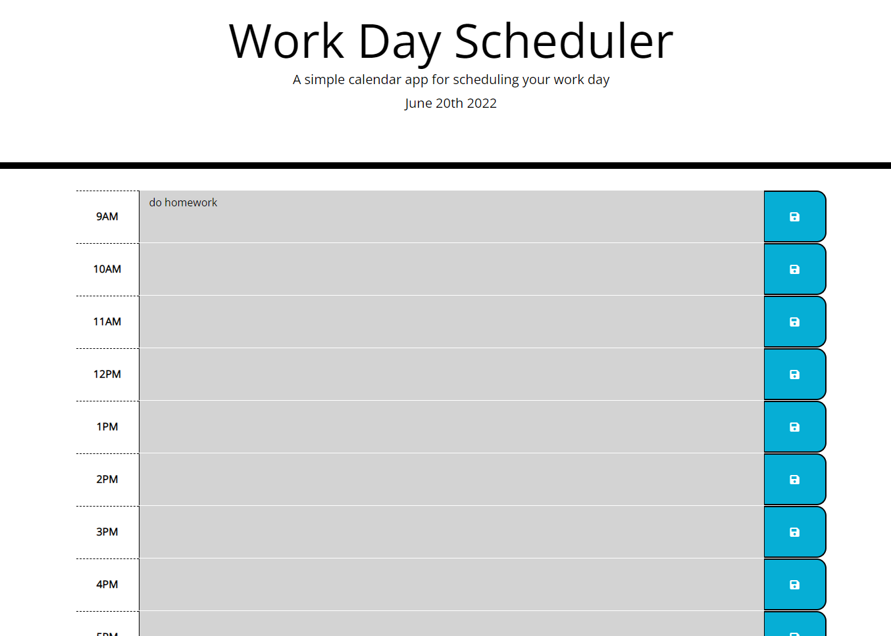

# Work Day Scheduler

## Description

This project provides an easy-to-use method of task and event tracking by the business hour. It allows for easy visualization of the day ahead. I learned a lot about setting and getting local storage in this challenge, as well as callback functions and using event listeners in jquery. I was motivated to take everything that I had learned through the lessons and apply them in a practical website. I wanted to build this project to challenge myself. I found it very exciting to learn bootstrap and jQuery together.

## Usage

To use the work day scheduler, click on the empty box next to the hour you would like to note an event or task for. To save your changes, click on the blue save button to the right of the time slot. A screenshot is provided below of what the password generator looks like:

    ```md
    
    ```

## Credits

Starter code retrieved from: https://github.com/coding-boot-camp/super-disco

## License

MIT License

Copyright (c) 2022 Shauna Lachelier

Permission is hereby granted, free of charge, to any person obtaining a copy
of this software and associated documentation files (the "Software"), to deal
in the Software without restriction, including without limitation the rights
to use, copy, modify, merge, publish, distribute, sublicense, and/or sell
copies of the Software, and to permit persons to whom the Software is
furnished to do so, subject to the following conditions:

The above copyright notice and this permission notice shall be included in all
copies or substantial portions of the Software.

THE SOFTWARE IS PROVIDED "AS IS", WITHOUT WARRANTY OF ANY KIND, EXPRESS OR
IMPLIED, INCLUDING BUT NOT LIMITED TO THE WARRANTIES OF MERCHANTABILITY,
FITNESS FOR A PARTICULAR PURPOSE AND NONINFRINGEMENT. IN NO EVENT SHALL THE
AUTHORS OR COPYRIGHT HOLDERS BE LIABLE FOR ANY CLAIM, DAMAGES OR OTHER
LIABILITY, WHETHER IN AN ACTION OF CONTRACT, TORT OR OTHERWISE, ARISING FROM,
OUT OF OR IN CONNECTION WITH THE SOFTWARE OR THE USE OR OTHER DEALINGS IN THE
SOFTWARE.

---

🏆 Thank you for reading!
